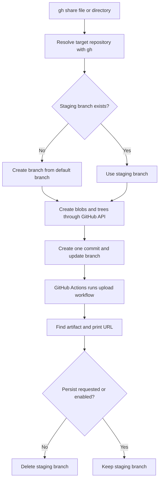

# gh-share

`gh-share` is a GitHub CLI (`gh`) extension that uploads a file or directory to a GitHub Actions artifact and prints the artifact URL.

The upload is performed through the GitHub API. It does not use the local Git repository to create or push commits.

## Usage

```bash
# Share a single-page HTML file
$ gh share pr123.html

# Upload a directory
$ gh share assets/

# Upload to another repository
$ gh share --repo owner/repo pr123.html

# Open the artifact URL after the upload completes
$ gh share --open pr123.html

# Keep the staging branch after the upload
$ gh share --persist pr123.html
```

The primary use case is sharing a single-page HTML file. The command also supports arbitrary files and directories.

The command displays progress while it creates the staging branch, creates the commit, waits for the workflow, and removes or keeps the branch. The final output includes links to the staging branch, commit, workflow run, and artifact.

For a file, the artifact contains the file under `gh-share-payload/<timestamp>/`. For a directory, the directory contents are uploaded as one artifact.

## How it works

`gh-share` uses a temporary branch and a workflow generated by the extension. This is intentionally a little unusual: the local repository is not used for any Git operation, and the payload is never committed to the default branch.



The process is:

1. Resolve the target repository with `gh repo view`.
2. Check whether the staging branch exists. If it does not, create it from the repository's default branch.
3. Create Git blobs for the payload and build the required tree structure through the GitHub Git Database API.
4. Add `.gh-share-payload-ref` and the embedded `.github/workflows/upload-gh-share-payload.yml` workflow, then create one commit containing all of them.
5. Update the staging branch to that commit. The push triggers the workflow because the payload paths changed.
6. Poll GitHub Actions until the workflow completes and resolve the artifact URL.
7. Delete the staging branch, unless persistence was requested or the branch already contains the persistence marker.

### Why this is tricky

GitHub Actions can only run a workflow that exists in the commit that triggered it. Therefore, the workflow must be uploaded together with the payload into the staging branch before the workflow can run.

The extension uses the Git Database API directly to create blobs, trees, commits, and refs. A single commit is important here: it gives the workflow one unambiguous commit SHA to monitor and avoids triggering the workflow multiple times during one upload.

The workflow reads `.gh-share-payload-ref` to find the timestamped payload directory and determine whether the input was a file or directory. It then uploads that directory with `actions/upload-artifact`.

The staging branch is based on the repository's default branch, so the GitHub API can build a valid commit without cloning or modifying the local repository.

## Command-line options

| Option | Description |
|--------|-------------|
| `--repo` | Target repository in `OWNER/REPO` format. Defaults to the current repository. |
| `--branch` | Staging branch name. Defaults to `gh-share-staging`. |
| `--open` | Open the artifact URL in the browser after the upload completes. |
| `--persist` | Keep the staging branch after the upload. |

## Installation

```bash
$ gh extension install k1LoW/gh-share
```

To update the extension:

```bash
$ gh extension upgrade share
```

To uninstall it:

```bash
$ gh extension remove share
```

## Prerequisites

- GitHub CLI (`gh`)
- A GitHub CLI authentication token with permission to create and update branches, commits, and files in the target repository
- GitHub Actions enabled in the target repository

Authenticate with:

```bash
$ gh auth login
```

For private repositories, the artifact URL requires access to the repository. Staging branches and artifacts may also be subject to the repository's retention and access policies.

## Development

To build and install the extension from source:

```bash
$ go build .
$ gh extension remove share
$ gh extension install .
```

Run the test suite and linters with:

```bash
$ go test ./...
$ golangci-lint run ./...
```

## License

[MIT](LICENSE)
